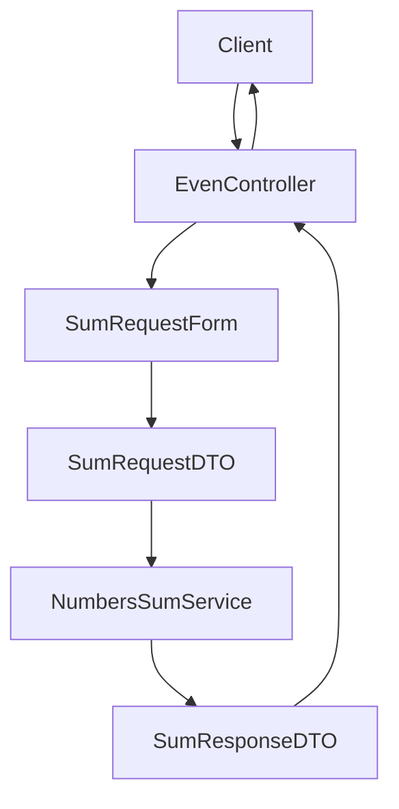

# Yii2 Sum API

Mini REST API on Yii2 that accepts an array of numbers and returns the sum of even numbers.

## Overview

- **Purpose**: Calculate the sum of even numbers from the provided array (supports numeric strings and negatives).
- **Stack**: PHP 8.3, Yii2, Docker, Codeception.
- **Architecture:** Clean and modular — Controller → Validation → DTO → Service → DTO → Response.
- **Quality**: Full tests with HTML coverage report.

## Installation (Docker)

```bash
make build
make up
```

Application will be available at `http://localhost:8000`.

## Usage Example

Request:

```bash
curl -X POST http://localhost:8000/api/sum-even \
  -H "Content-Type: application/json" \
  -d '{"numbers":[1,2,3,4,5,6,"8","-10"]}'
```

Response:

```json
{"sum": 10}
```

---

## Architecture




## Project Structure

```
yii2-sum-ap/
├── config/            # App configuration (DI, web, etc.)
├── controllers/       # Controllers (incl. EvenController)
├── src/               # App logic (DTO, Contracts, Services, Validation, Http)
├── tests/             # Tests and coverage reports
├── Dockerfile         # Docker image config
├── docker-compose.yml # Docker Compose services
├── Makefile           # Dev helper commands
└── README.md          # Documentation
```

## Features

- **REST API** for even-sum calculation
- **Data validation and unified error handling** (structured responses and correct HTTP status codes)
- **Clean architecture** (DTOs, interfaces, services)
- **Dockerized** for easy start
- **HTML coverage reports**

---

## Tests

### Quick commands

```bash
# 1) Run unit tests
make test

# 2) Run unit tests with coverage (HTML report)
make test-coverage
```

### 1) Run unit tests (no coverage)

```bash
make test
```

- Output: summary in terminal (number of tests and assertions).
- No HTML report generated in this mode.

### 2) Run unit tests with coverage

```bash
make test-coverage
```

After completion, the HTML report is available at:

```
tests/_output/coverage/index.html
```

Open from Docker (recommended):

```bash
make open-coverage-docker
```

Tips:

- Ensure containers are up before running tests with coverage on first run (`make up`).
- Coverage uses Xdebug inside the container; no local PHP setup is required.
